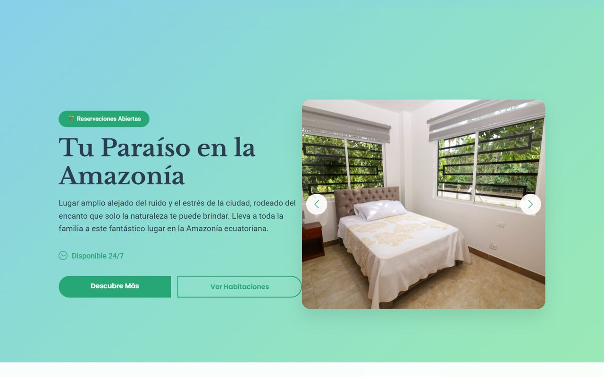
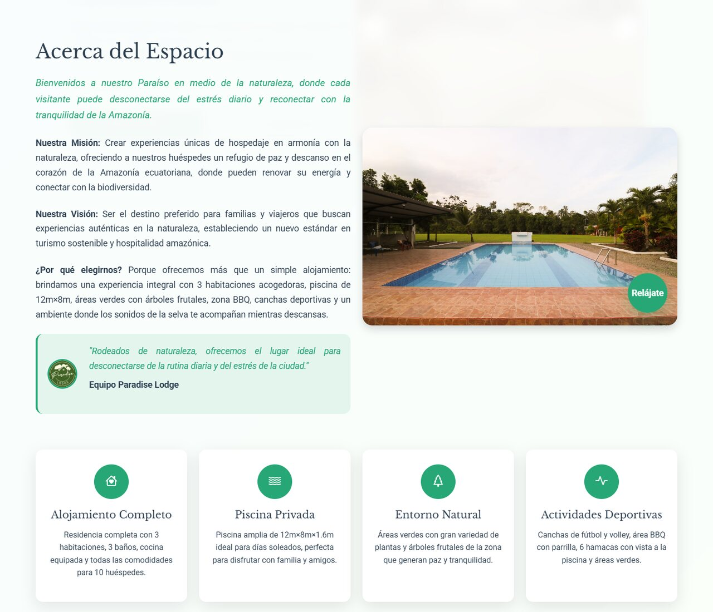
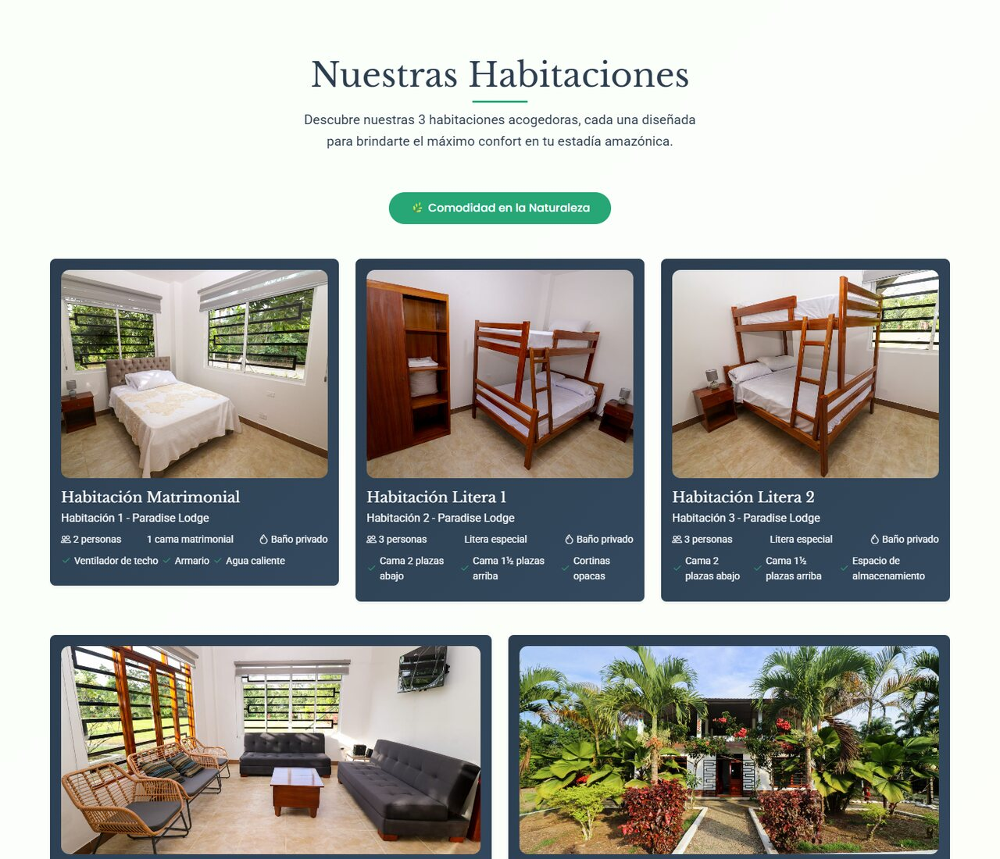
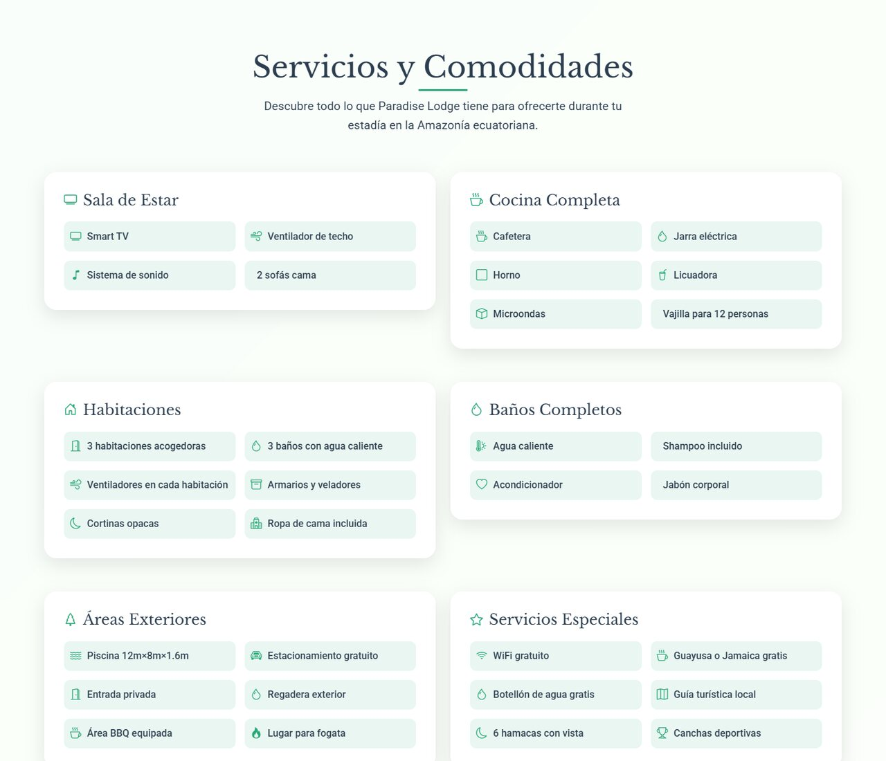
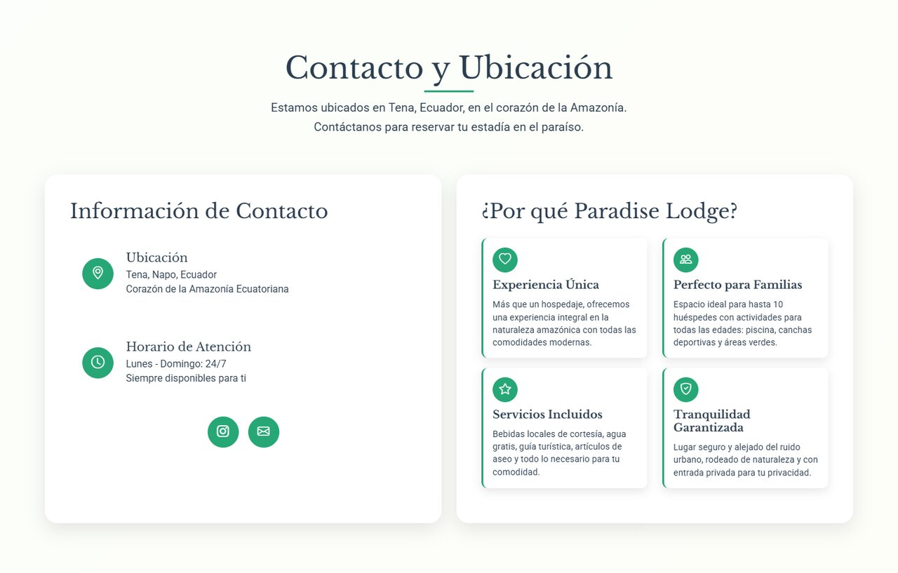
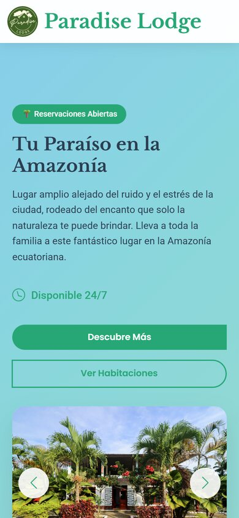

<div align="center">

# Paradise Lodge

### Sitio web corporativo para un hospedaje turístico en Tena, Amazonía ecuatoriana

[](https://developer.mozilla.org/docs/Web/HTML)
[](https://developer.mozilla.org/docs/Web/CSS)
[](https://developer.mozilla.org/docs/Web/JavaScript)
[](#)
[](#)

**[Ver sitio en vivo](https://adrizzx.github.io/Paradise-Lodge/)**



</div>

---

## Descripción

Sitio web desarrollado y **entregado a una empresa de turismo** para promocionar Paradise Lodge, un hospedaje ubicado en Tena (Napo, Ecuador). El objetivo fue darle al negocio una presencia digital propia: mostrar sus instalaciones, habitaciones y servicios, y facilitar el contacto directo de los huéspedes.

## Capturas

<table>
  <tr>
    <td width="50%"></td>
    <td width="50%"></td>
  </tr>
  <tr>
    <td align="center"><sub>Sobre el hospedaje</sub></td>
    <td align="center"><sub>Habitaciones</sub></td>
  </tr>
  <tr>
    <td width="50%"></td>
    <td width="50%"></td>
  </tr>
  <tr>
    <td align="center"><sub>Servicios y comodidades</sub></td>
    <td align="center"><sub>Contacto y ubicación</sub></td>
  </tr>
</table>

<div align="center">
  
  <br><sub>Vista en dispositivo móvil</sub>
</div>

## Características

- Diseño **responsive** adaptado a móvil, tablet y escritorio.
- Secciones de inicio, presentación del lodge, servicios y comodidades, habitaciones, contacto y ubicación.
- Navegación fluida con desplazamiento suave, menú adaptable y animaciones al hacer scroll.
- Formulario de contacto con validación en el cliente.
- Galería de fotografías reales de las instalaciones.
- Sitio estático de carga rápida, sin dependencias de compilación.

## Estructura

```
├── index.html        Estructura y contenido del sitio
├── style.css         Estilos y diseño responsive
├── main.js           Interacciones, animaciones y validación
└── public/images/    Fotografías de las instalaciones
```

## Ejecución local

Abrir `index.html` en el navegador o servir la carpeta:

```bash
npx serve .
```

## Autor

**Marco Adrian Padilla Triviño** · Diseño y desarrollo web

[](https://github.com/Adrizzx)
